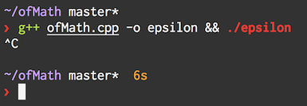
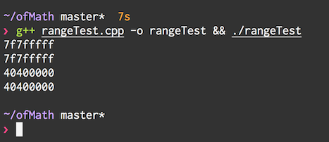
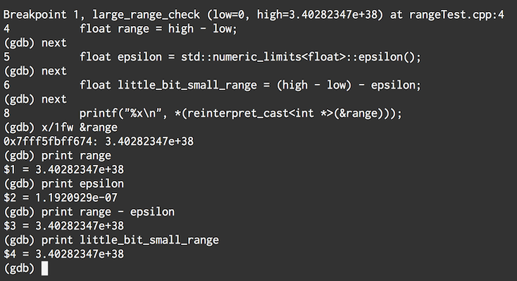
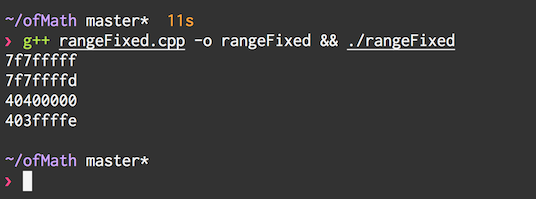

# EPSILON! fixes 3, 4, and 5

A second idea from arturo was [compiled into a new pull request][3] - this one really looks like it will work. A modified version is included in **ofMath.cpp**. The important bit is:

```c++
range -= std::numeric_limits<float>::epsilon();
```

This patch reduces the range of possible return values by epsilon, a special number that means 'the smallest possible amount'. And if we try the proposed fix, it seems to work!



From the title, this cannot be the final fix. And 2bit knows this. 2bit wants to be super sure that `-= std::numeric_limits<float>::epsilon()` really does reduce the range when working with large numbers, when casting them as integers and devises this `rangeTest.cpp`:

```c++
#include <iostream>

void large_range_check(float low, float high) {
    float range = high - low;
    float little_bit_small_range = (high - low) - std::numeric_limits<float>::epsilon();

    printf("%x\n", *(reinterpret_cast<int *>(&range)));
    printf("%x\n", *(reinterpret_cast<int *>(&little_bit_small_range)));
}

int main(){
  large_range_check(0.0f, std::numeric_limits<float>::max());
  large_range_check(0.0f, 3.0f);
}
```

We can run rangeTest in the usual manner, `g++ rangeTest.cpp -o rangeTest && ./rangeTest`



Turns out, not only does it fail when casting to integers with large floats, but it also does with small floats, like 3.0f! The numbers haven't moved at all!

Why is this? Well, time to break out gdb, and do some sluething...



Turns out, *at "big" numbers, epsilon is smaller than the 'gap' between two consecutive floats*. I think this is so terribly cool.

And the quick fix that 2bit comes up with is to multiply the range by (1.0-epsilon), like so:

```c++
float range = high - low;
range *= (1.0f - std::numeric_limits<float>::epsilon());
```

This is a performance penalty, but at least reduces our MAX_RAND range by 1, as shown in **rangeFixed.cpp** `g++ rangeFixed.cpp -o rangeFixed && ./rangeFixed`:



Well, openFrameworks is an international community, and kyle comes up with another solution in parallel to the multiply by epsilon fix...

# Next

To move onto the next step, do `git checkout nextafter`

# Overview

This repository contains source code and commentary explored in [openFrameworks][1] [pull request #3842][2].

From the sidelines, it was really interesting to follow along the discussion about floating point numbers, and randomness.

I am trying to figure out the best way to expose the code for learning. If you have suggestions, please make an issue on github!

After cloning this repository, I recommend checking out the first commit `git checkout initial`, and then moving up one commit at a time.

This readme will change, explaining the different approaches taken on the quest for a ofRandom that works well.


[1]: http://openframeworks.cc
[2]: https://github.com/openframeworks/openFrameworks/pull/3842
[3]: https://github.com/2bbb/openFrameworks/commit/c3c36d41e5778c3ba005ea4e9b84046c6b8d3394
