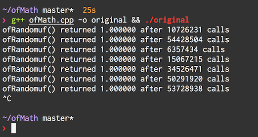
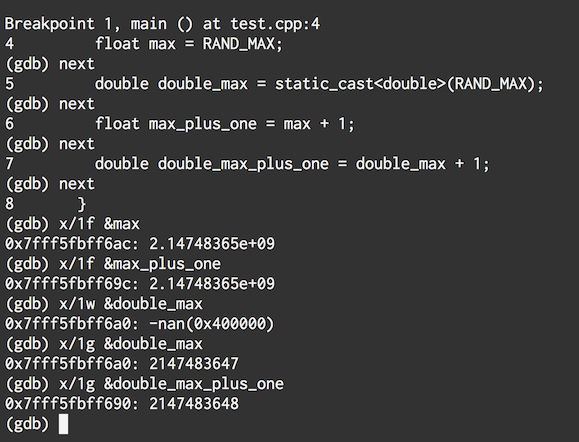
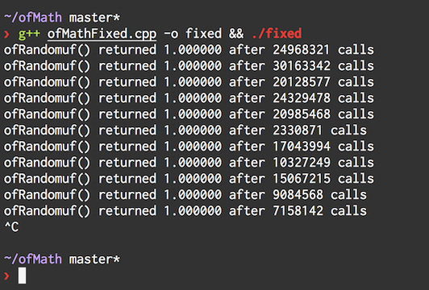

# The First Patch...

So the error that 2bit encountered with ofRandomuf() is that sometimes it returns 1.00000... and ofRandomuf() should only return numbers from 0 (including 0) up to 1 (not including 1). kylemcdonald comes up with a test case, included as **ofMain.cpp**, so let's run it on the original code without 2bits modifications. Remember, you can press control+c to quit the program:

The original, unmodified ofRandomuf() function...

```c++
float ofRandomuf(){
  return rand() / (RAND_MAX + 1.0f);
}
```

.. will sometimes return 1.000 (try `g++ original.cpp -o original && ./original`):



# ...has some bugs

So 2bit's proposed fix, is to change `RAND_MAX + 1.0f` to `static_cast<double>(RAND_MAX) + 1.0`. The idea is that we will avoid floating point errors by using a higher precision type, a double. Which should be able to handle both a larger range of numbers, and more steps between each number.

On 32 and 64 bit machines, a float is still 32 bits - the first bit is for sign + or -, the next 8 are for the exponent, and the next 23 are for the fraction.

A double, as its name may imply, uses double the number of bits to represent whatever number we want. 1 sign, 11 exponent, 52 fraction. More range! More precision! Slower calculations!

Heres a little exploration I did to see what the cast from float to double does:

```c++
include <iostream>
int main() {
  float max = RAND_MAX;
  double dbl_max = static_cast<double>(RAND_MAX);
}
```

and if we try debugging with `g++ -g test.cpp -o test && gdb test`, then `break main`, `next`, `next`, we can inspect the memory:

```
# interperet one word, 4 bytes, 32 bits, as a float (equivalent to x/1fw)
(gdb) x/1w &max
2.14748365e+09

# interperet one biGword, 8 bytes, 64 bits, as a float (equivalent to x/1fg)
(gdb) x/1g &dbl_max
2147483647
```

Well I didn't notice until after typing this, that the numbers are actually different! Even if we are casting to a more precise type, we will introduce errors because the numbers we can represent are different! I am not sure why gdb prints a single precision floating point number with the floating point, and a double precision without. log2(2147483647) is very very close to 31. I'm kinda grabbing in the dark here, but if you have ideas as to why please share them. It probably has something to do with the actual IEEE754 specification, which I didn't read.

Anyway, 2bits fix should work right? Let's look at this:

```c++
#include <iostream>

int main() {
  float max = RAND_MAX;
  double double_max = static_cast<double>(RAND_MAX);
  float max_plus_one = max + 1;
  double double_max_plus_one = double_max + 1;
}
```



Well that looks promising. So lets finally integrate our solution, with kyle's test case in **ofMainFixed.cpp**.

    g++ ofMainFixed.cpp -o fixed && ./fixed



Craaaap >\_< ... what happened?

I think there are *two issues at hand*. The first is that the ofRandomuf() function returns a float, not a double. So it gets cast back....and loses some precision along the way.

But the second issue you can see if you try compiling and running **test.cpp** - the first cast to double actually lowers the max by 1, so adding 1 just keeps in the same.

Bottom line I can see is **AVOID CASTS AT ALL COSTS** changing types is really tricky and finicky. This was meant to be a quick fix, but opened up a can of worms (maybe you know that feeling?).

So are we back to square one? I think so... let's see some new ideas when arturoc enters the scene...

# Next

To move onto the next step, do `git checkout recursion-isnt-that-bad`

# Overview

This repository contains source code and commentary explored in [openFrameworks][1] [pull request #3842][2].

From the sidelines, it was really interesting to follow along the discussion about floating point numbers, and randomness.

I am trying to figure out the best way to expose the code for learning. If you have suggestions, please make an issue on github!

After cloning this repository, I recommend checking out the first commit `git checkout initial`, and then moving up one commit at a time.

This readme will change, explaining the different approaches taken on the quest for a ofRandom that works well.


[1]: http://openframeworks.cc
[2]: https://github.com/openframeworks/openFrameworks/pull/3842
