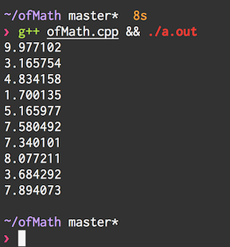

# Compiler check

Alright, first things first, lets make sure our compiler and libraries are setup correct.

In this directory, you should see a file called **ofMath.cpp**. This is a short bit of code extracted
from [pull request #3842][2]. It contains the most complex version of any code we may run throughout this
interactive tutorial. It should work on osx, linux, and probably bsd.

To compile and run ofMath.cpp, open up a terminal in this directory, and try running the following command:

    g++ ofMath.cpp && ./a.out

A bunch of random numbers should print out to the terminal, and look like

If you ever need to exit from a running program, you can press control+c to 'kill' the running program.

If there is any trouble getting this to work, please make a github issue and I will try and help out!

# Next

To move onto the next step, do `git checkout the-problem`

# Overview

This repository contains source code and commentary explored in [openFrameworks][1] [pull request #3842][2].

From the sidelines, it was really interesting to follow along the discussion about floating point numbers, and randomness.

I am trying to figure out the best way to expose the code for learning. If you have suggestions, please make an issue on github!

After cloning this repository, I recommend checking out the first commit, and then moving up one commit at a time.

This readme will change, explaining the different approaches taken on the quest for a ofRandom that works well.

[1]: http://openframeworks.cc
[2]: https://github.com/openframeworks/openFrameworks/pull/3842
